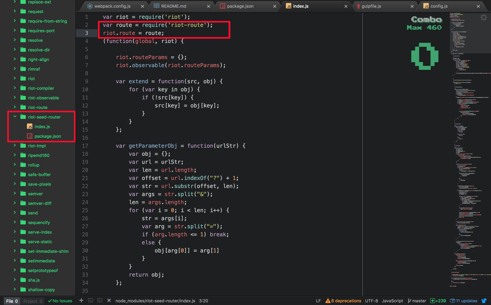

# riot-zero 新手demo项目

## 适用人群
刚入坑的新人、对hi团队的前端开发工具不熟悉的同学

## 目的
1、能够快速熟悉hi团队的主力ui框架riot的使用
2、通过配置gulp任务和webpack使得你的项目增强。（只做了基最本的配置，更多功能需要新人自己去完善补充）;


## 安装项目过程需要注意的一个地方
由于riot-seed-route是基于老版本的riot,新版本中riot将riot-route分离出来，所以需要在riot-seed-route源码中添加对riot-route的依赖




## 启动项目

1、开发环境
```
npm run dev
```
3、生产环境
```
npm run build
```

## 具体练手的项目不固定
可以从现有的hi内的项目去模仿，或者其他比较稍微简单的项目
例子：http://eux.baidu.com/
